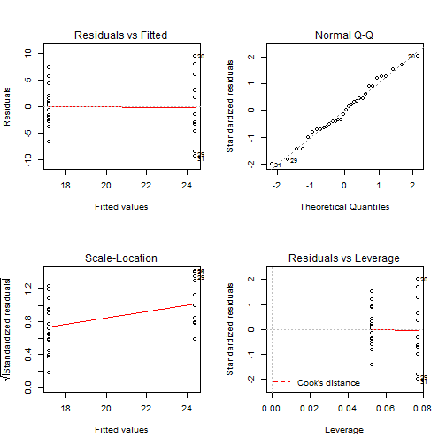
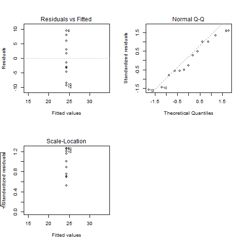
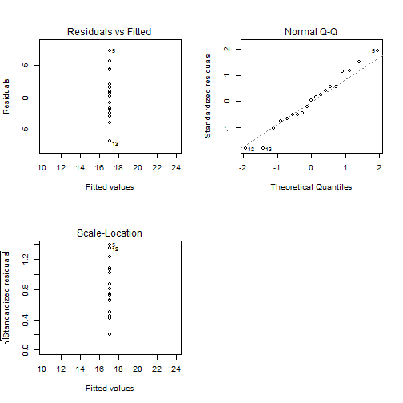

Dependence of Transmission Type on MPG
========================================================

## Ececutive Summary

The aim of this analysis is to discover the dependence of transmission type on miles per gallon for *Moto Trend* magazie from the dataset *mtcars*. First of all the exploratory analysis is done and the initial assumpions and hypothesis are stated. Next, the three regression models are choosen for furher analysis and initial hypothesis testing. Finally, after validity testing, following answers on requested questions can be made:

1. *Is an automatic or manual transmission better for MPG?*
    
    Our model has confirm the initial hypothesis that the manual transmission is better for mpg. For numbered explanation see answer on the second question. 
    
2. *Quantify the MPG difference between automatic and manual transmissions?*

    First-order difference can be counted as difference of intersects/means (see exploratory analysis point 2) and this gives us the value of **7.245** (the same as our first model). This can be explained as the additional distance which can be ridden with manual transmission.
    
    Now a word or two about significance of this result. As can be seen in the table of confidence intervals for model with both transmissions, this interval has no intersection (**15.24-19.06 for automatic, 19.49-29.30 for manual**). This can be state as significance of our results.

## Analysis

The aim of this analysis is to discover the dependence of transmission type on miles per gallon. Namely, it is worth to answer following two questions:

1. *Is an automatic or manual transmission better for MPG?*
2. *Quantify the MPG difference between automatic and manual transmissions?*

The mtcars dataset is used for this analysis, namely columns mpg and am. 

### Exploratory Data Analysis

First of all, the roughly description of our data set is needed. The data are two dimensional so it it possible to plot them directly. The direct plot and boxplot of our data is in in Appendix in the Figure 1. At this point can be stated following:

1. With respect to the visual and boxplot quartile diagnostics it can be stated that **there are no outliers or leverage points** in our data set.


2. Explaining variable is two-level/factor variable. It is obvious that the **regression coefficients/intercepts** will have **values of 17.1474 for automatic and 24.3923 for manual transmission** with reference level 0.

3. Because there is a **difference** in these values **7.2449**, we can state now our primary **hypothesis** that **manual transmission gives mor miles per gallon**. On the other hand, it can not be say anything about the significance of this difference. That is why further detailed analysis is needed.

### Regression Modeling

The regression modeling will be used for further analysis. There will be studied three models in this section. For each model there is a summary of estimated parameters, confidence intervals, R squared and sigma, and residuals diagnostics.

#### Regression relationship transmission (both automatic, manual) vs mpg


```
##                    Estimate Std. Error t value  Pr(>|t|)
## Automatic            17.147      1.125  15.247 1.134e-15
## Change Auto-Manual    7.245      1.764   4.106 2.850e-04
```

```
##                      5 %  95 %
## Automatic          15.24 19.06
## Change Auto-Manual  4.25 10.24
```

```
##   RSquared Sigma MeanOfResiduals CovResiduals
## 1   0.3598 4.902      -6.592e-17    1.565e-16
```


#### Regression relationship manual vs mpg


```
##        Estimate Std. Error t value  Pr(>|t|)
## Manual    24.39       1.71   14.26 6.909e-09
```

```
##          5 %  95 %
## Manual 21.34 27.44
```

```
##   RSquared Sigma MeanOfResiduals CovResiduals
## 1   0.9443 6.167       5.124e-16            0
```

#### Regression relationship automatic vs mpg


```
##           Estimate Std. Error t value  Pr(>|t|)
## Automatic    17.15     0.8796    19.5 1.497e-13
```

```
##             5 %  95 %
## Automatic 15.62 18.67
```

```
##   RSquared Sigma MeanOfResiduals CovResiduals
## 1   0.9548 3.834      -1.638e-16            0
```

#### Models Diagnostics

All models are **linear**, so it is no problem with usage of OLS. From diagnostics Figures can be seen that the **residuals are normaly distributed with mean equal to zero** and are **not correlated with transmition variable**. Therefore the assumptions of normality is fullfiled and the estimatian is meaningful.

Now, when the models are meaninful, the resutled estimations can be discussed. All estimations of regression coefficients are significant. Better results are in single manual and automatic model, on the other hand for the questions it can be better to hold them together in one model.

## Appendix

Figure 1: Exploratory Data Analysis

 

Figure 2: Diagnostics of regression relationship transmission (both automatic, manual) vs mpg

 

Figure 3: Diagnostics of regression relationship manual vs mpg

 


Figure 4: Diagnostics of regression relationship automatic vs mpg


 
