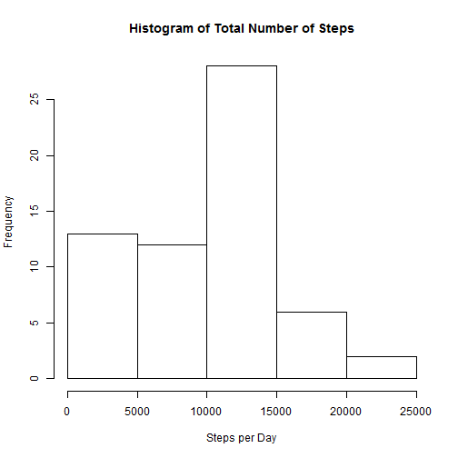
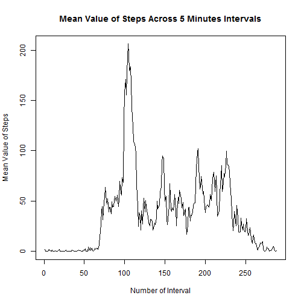
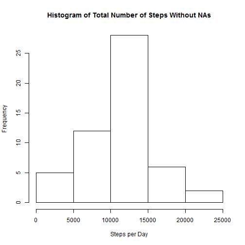
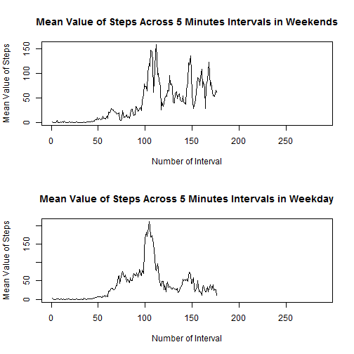

# Reproducible Research: Peer Assessment 1

Exploratory analysis from the personal monitoring device. This device collects rawData at 5 minute intervals through out the day. The rawData consists of two months of rawData from an anonymous individual collected during the months of October and November, 2012 and include the number of steps taken in 5 minute intervals each day.

## Loading and preprocessing the rawData

Reading a rawData from a zip file from the current directory.


```r
    rawData <- read.csv(unz("activity.zip", "activity.csv"), sep=",")
```


## What is mean total number of steps taken per day?

1. Fist of all, a histogram of the total number of steps taken each day is created.
    
    
    ```r
        StepsPerDay<-tapply(rawData$steps,rawData$date,sum,na.rm=TRUE)
    
        hist(StepsPerDay, main="Histogram of Total Number of Steps",xlab="Steps per Day")
    ```
    
     
    
2. Next, the mean and median total number of steps taken per day is calculated.
    
    ```r
        meanStepsPerDay<-mean(StepsPerDay,na.rm=TRUE)
        medianStepsPerDay<-median(StepsPerDay,na.rm=TRUE)
    ```
    The mean is 9354.2295 and the median is 10395.

## What is the average daily activity pattern?

The time series plot of the 5-minute interval (x-axis) and the average number of steps taken, averaged across all days (y-axis), is following.


```r
    StepsPerInterval<-tapply(rawData$steps,rawData$interval,mean,na.rm=TRUE)

    plot(StepsPerInterval, main="Mean Value of Steps Across 5 Minutes Intervals",xlab="Number of Interval",
         ylab="Mean Value of Steps",type="l")
```

 

```r
    inIntervalNumber<-which.max(StepsPerInterval)
    maxValue<-StepsPerInterval[inIntervalNumber]
    inIntervalLabeled<-names(inIntervalNumber)
```

There is obvious that the maximum value is only one and it is the value 206.1698 in interval number 104 labeled as 835.

## Imputing missing values

1. The problem of the rawDataset are missing values.

    
    ```r
        nOfMissingSteps<-sum(is.na(rawData$steps))
        nOfMissingDate<-sum(is.na(rawData$date))
        nOfMissingInterval<-sum(is.na(rawData$interval))
    ```
There are 2304 missing values in column Steps and fortunately 0 and 0 in columns date and interval.
2. The new dataset "data" for steps without NAs is created and NAs are owerwrited with the mean of appropriate 5 min  interval. 
    
    ```r
        data<-rawData
        for (i in seq_along(data$steps)) {
            if (is.na(data$steps[i])) {
                data$steps[i]<-StepsPerInterval[data$interval[i]/5+1]
            }
        }  
    ```
3. Histogram of updated data.
    
    ```r
        StepsPerDayWithotNAs<-tapply(data$steps,data$date,sum)
    
        hist(StepsPerDayWithotNAs, main="Histogram of Total Number of Steps Without NAs", 
        xlab="Steps per Day")
    ```
    
     
    
    ```r
        meanStepsPerDayWithouNAs<-mean(StepsPerDayWithotNAs,na.rm=TRUE)
        medianStepsPerDayWithoutNAs<-median(StepsPerDayWithotNAs,na.rm=TRUE)
    ```
4. The mean value of updated dataset is 1.0766 &times; 10<sup>4</sup> and the median is 1.0765 &times; 10<sup>4</sup>. These values differs from values from dataset with NAs. This is due to the methodology of replacing the NAs. In our approach the 5 min interval behaviour was preserved, but the mean and median value not.

## Are there differences in activity patterns between weekdays and weekends?

Creating a variable indication weekday and weekend and plotting the time series plot of the 5-minute interval (x-axis) and the average number of steps taken, averaged across all weekday days or weekend days (y-axis).


```r
    data$dayOfWeek <- factor("weekday",levels=c("weekend","weekday"))
    for (i in seq_along(data$dayOfWeek)) {
        if (weekdays(as.Date(data$date[i]))=="nedìle" | weekdays(as.Date(data$date[i]))=="sobota") {
                data$dayOfWeek[i]<-factor("weekend",levels=c("weekend","weekday"))
        }
    }

    weekdays<-data[data$dayOfWeek=="weekday",]
    StepsPerIntervalWeekdays<-tapply(weekdays$steps,weekdays$interval,mean)

    weekends<-data[data$dayOfWeek=="weekend",]
    StepsPerIntervalWeekends<-tapply(weekends$steps,weekends$interval,mean)
    
    par(mfrow=c(2,1))
    plot(StepsPerIntervalWeekends, main="Mean Value of Steps Across 5 Minutes Intervals in Weekends",
         xlab="Number of Interval",
         ylab="Mean Value of Steps",type="l")
    plot(StepsPerIntervalWeekdays, main="Mean Value of Steps Across 5 Minutes Intervals in Weekday",
         xlab="Number of Interval",
         ylab="Mean Value of Steps",type="l")
```

 

