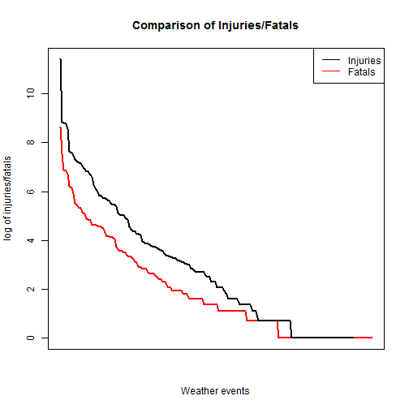
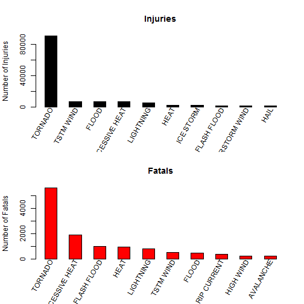
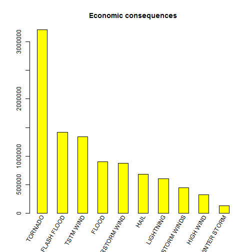

Weather Impact on Population Health and Economics in USA
=======================================================

## Synopsis

The weather can create a lot of dangerous events with consequences in health and economic areas. This study 
deals with them in accordance with dataset from the U.S. National Oceanic and Atmospheric Administration's (NOAA) storm database.  

## Data Processing

1. Reading a Data

    The data have to be in a current directory. Then it is read into variable "rawData"

    
    ```r
    displayResults<-FALSE
    
    rawData<-read.csv("repdata-data-StormData.csv")
    if (displayResults){
        View(rawData)
        head(rawData)
        summary(rawData)    
    }
    ```
    
    There is needed only columns "EVTYPE","INJURIES","FATALITIES", and "PROPDMG" for our analysis. That is
    why a new variable "selectedData" is created.
    
    
    ```r
    selectedData<-rawData[,c("EVTYPE","INJURIES","FATALITIES","PROPDMG")]    
    if (displayResults){
        View(selectedData)
    }
    ```

2. Processing a data    
    
    Creating a most harmful weather event - fatal and injuries - and weather events with the greatest
    economic consequences.
    
    
    ```r
        fatal<-aggregate(FATALITIES ~ EVTYPE, data = selectedData, sum, na.rm = TRUE)
        fatal <- fatal[order(fatal$FATALITIES,decreasing = TRUE, na.last=TRUE) , ]
        if (displayResults){
            View(fatal)
        }
        
        injur<-aggregate(INJURIES ~ EVTYPE, data = selectedData, sum, na.rm = TRUE) 
        injur<-injur[order(injur$INJURIES,decreasing = TRUE, na.last=TRUE), ]
        if (displayResults){
            View(injur)
        }
    
        econ<-aggregate(PROPDMG ~ EVTYPE, data = selectedData, sum, na.rm = TRUE) 
        econ<-econ[order(econ$PROPDMG,decreasing = TRUE, na.last=TRUE), ]
        if (displayResults){
            View(econ)
        }
    ```

## Results

1. Most harmful weather events
      
    Figure 1: Comparison of injuries/fatals.
    
    ```r
        plot(log(fatal[,2]),
            type="l",
            col="red",
            xaxt="n",
            ylim=c(0,max(log(injur[,2]))),
            xlim=c(1,sum(fatal[,2]>0)),
            xlab="Weather events",
            ylab="log of injuries/fatals",
            main="Comparison of Injuries/Fatals",
            lwd=2)
        lines(log(injur[,2]),col="black",lwd=2)
        legend("topright",
            legend=c("Injuries","Fatals"), 
            col=c(rgb(0,0,0),"red"),  
            lty=c(1,1,1),
            cex=1, pt.cex = 2)           
    ```
    
     
    
    First of all, the Figure 1 compare the number of injuries/fatals in decreasing order. 
    
    Figure 2: Detailed wiev on injuries/fatals - top 10.
    
    
    
    ```r
        par(mfrow=c(2,1))
        
        barplot(injur[1:10,2],
            names=injur[1:10,1],
            main="Injuries",
            xlab="",
            ylab="Number of Injuries",
            col="black",
            xaxt="n",
            space=1)
        text(seq(1.5,19.5,by=2), 
            par("usr")[3]-0.25,
            srt = 60, 
            adj= 1, 
            xpd = TRUE,
            labels = injur[1:10,1], 
            cex=1)        
        
        barplot(fatal[1:10,2],
            names=fatal[1:10,1],
            main="Fatals",
            xlab="",
            ylab="Number of Fatals",
            col="red",
            xaxt="n",
            space=1)
        text(seq(1.5,19.5,by=2), 
            par("usr")[3]-0.25,
            srt = 60, 
            adj= 1, 
            xpd = TRUE,
            labels = fatal[1:10,1], 
            cex=1)
    ```
    
     
    
    There is a detailed wiev in Figure 2 with ten most impactful weather events. It can be easily seen that
    the most heatlh-impac weather event is tornado.
    
2. Events with the greatest economic consequences

    
    ```r
        par(mfrow=c(1,1))
        barplot(econ[1:10,2],
            names=econ[1:10,1],
            main="Economic consequences",
            xlab="",
            ylab="",
            col="yellow",
            xaxt="n",
            space=1)
        text(seq(1.5,19.5,by=2), 
            par("usr")[3]-0.25,
            srt = 60, 
            adj= 1, 
            xpd = TRUE,
            labels = econ[1:10,1], 
            cex=1)
    ```
    
     
    
    Similar situation is in the field of economic consequences.
