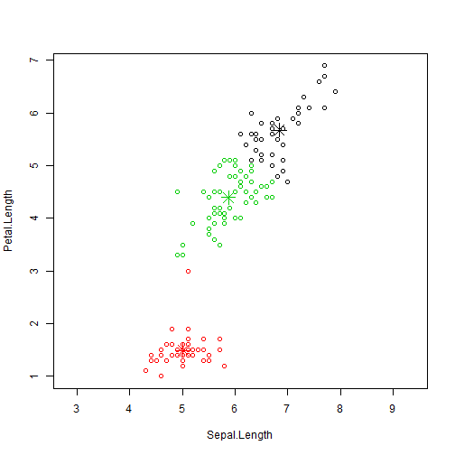

## What is k-mean Clustering?

- k-mean is an algorithm for assigning data into k distinct clusters
- Mathematicaly, the aim is to minimize the squared Euclidean distance
$$\min_{C_1,...,C_k} \sum_{l=1}^{k}\frac{1}{\vert{C_l}\vert}\sum_{i,i'\in C_l} 
\sum_{j=1}^{p}(x_{ij}-x_{i'j})^2$$
- It is impossible to solve it for larger data sets, heuristic algorith is needed

---
## k-mean Clustering Algorithm
1. Randomly assign a number, from 1 to K, to each of the observations. These serve as initial cluster assignments for the observations. 

2. Iterate until the cluster assignments stop changing: 
  
  a. For each of the K clusters, compute the cluster centroid. The kth cluster centroid is the vector of the p feature means for the observations in the kth cluster. 
  
  b. Assign each observation to the cluster whose centroid is closest (where closest is defined using Euclidean distance). 
  

- Guarantees decrease of the value of objective function
- Results depend on the initial (random) cluster assignment

---
## Shiny Application

- Uses Iris data set
- User can change the number of clusters k and the max number of iterations
- R kmeans function is used for calculation

---
## Example Plot with 3 clusters and 5 iterations

 
